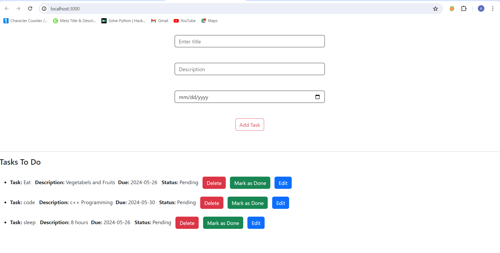

# React Todo App

This is a simple Todo App built with React for the frontend and Express with MongoDB for the backend.



## Table of Contents

1. [Prerequisites](#prerequisites)
2. [Installation](#installation)
3. [Running the Application](#running-the-application)
4. [Project Structure](#project-structure)
5. [API Endpoints](#api-endpoints)
6. [Contributing](#contributing)
7. [License](#license)

## Prerequisites

Before you begin, ensure you have met the following requirements:

- Node.js installed (https://nodejs.org/)
- npm (Node Package Manager) installed
- MongoDB installed and running (https://www.mongodb.com/try/download/community)

## Installation

1. **Clone the repository:**

```bash
git clone https://github.com/aman8218/Todo-App---Reactjs.git
cd your-repo-name

2. **Install backend dependencies:**

cd backend
npm install
  
 Install frontend dependencies:
 
cd ..
npm install

## Start the application:
 npm run dev

This will concurrently start both the backend and frontend servers.

Backend server will run on: http://localhost:3001
Frontend server will run on: http://localhost:3000

API Endpoints
GET /tasks

Fetch all tasks.
POST /tasks

Add a new task.
Body:
{
  "title": "Task Title",
  "description": "Task Description",
  "dueDate": "2024-05-30",
  "status": "pending"
}


PUT /tasks/

Update an existing task.

DELETE /tasks/

Delete a task.

Contributing
Contributions are always welcome! Please create a pull request or open an issue to discuss what you would like to change.